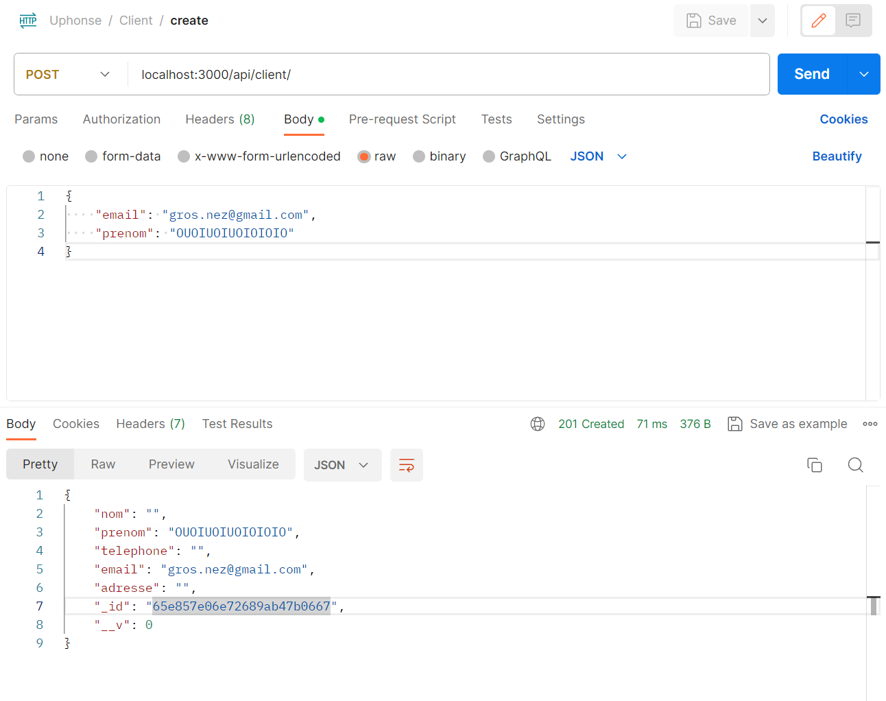
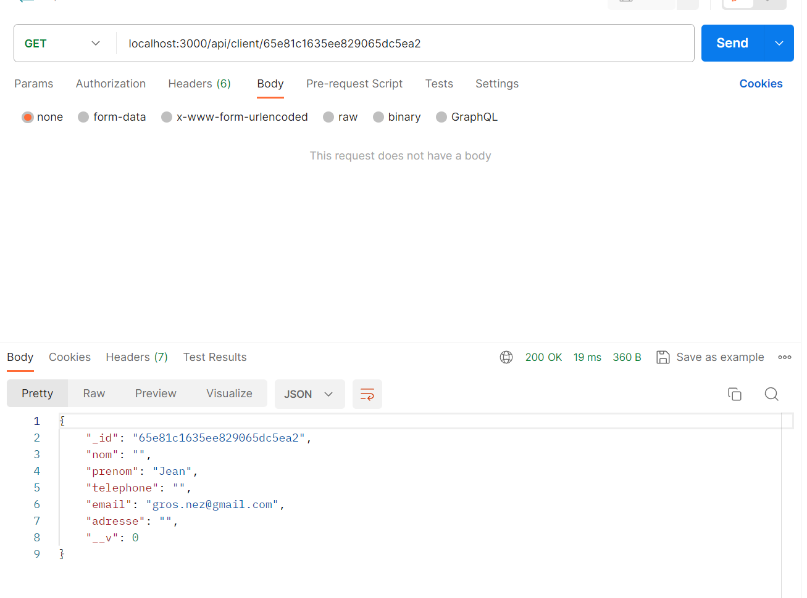
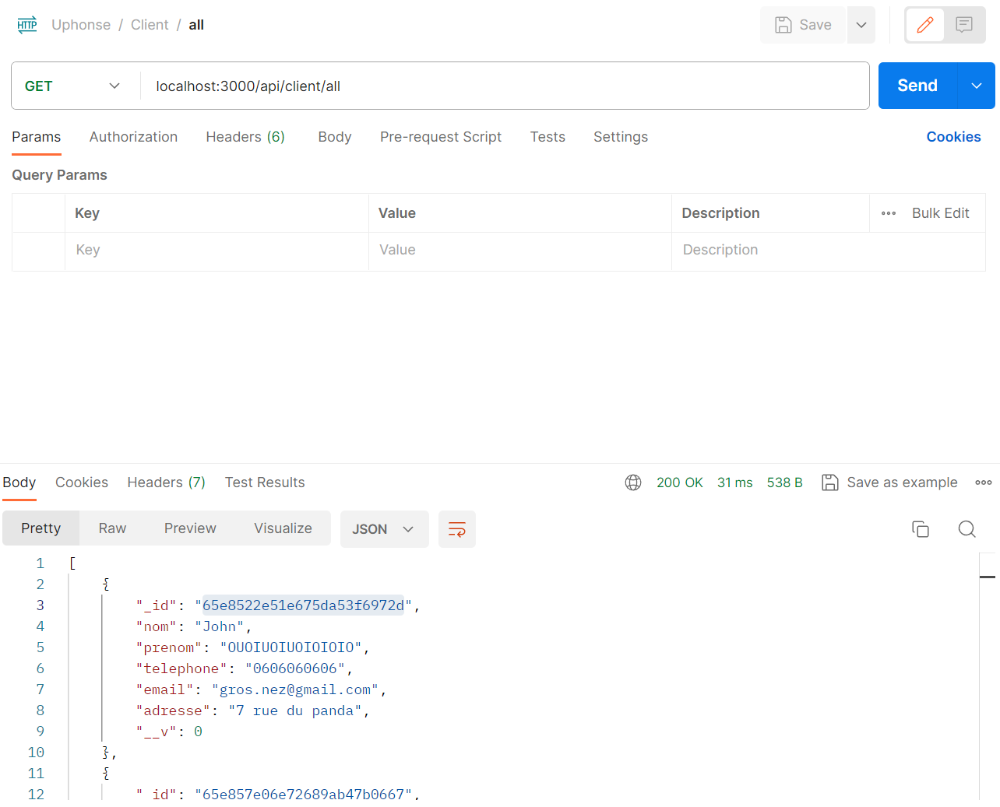
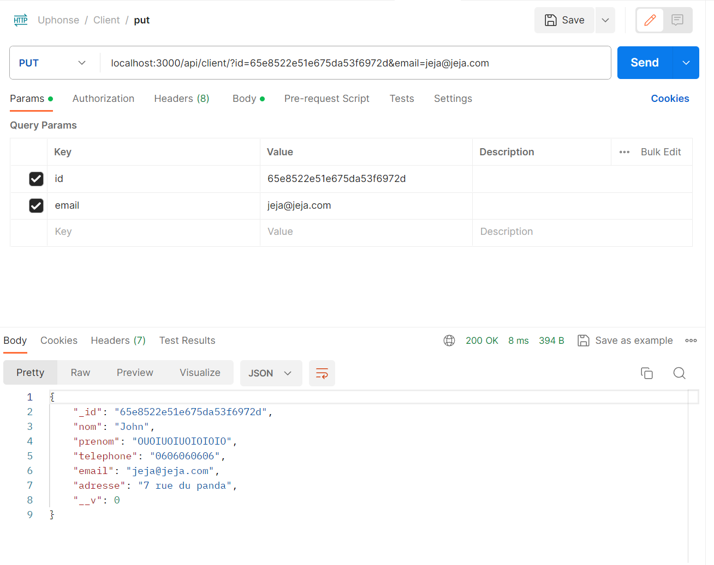

# Uphonse

## Infos
### Historique
Les commandes ont des dates qui doivent être supprimer avec un TTL (qui n'a pas fonctionné pour moi)

### Localisation livreurs
A chaque update du champ localisable on enlève ou non les coordonées de livreur

## Modèle de donnée

### Client
```js
const clientSchema = new mongoose.Schema({
    nom: {
        type: String,
        default: ''
    },
    prenom: {
        type: String,
        default: ''
    },
    telephone: {
        type: String,
        default: ''
    },
    email: {
        type: String,
        default: ''
    },
    adresse: {
        type: String,
        default: ''
    },
});
```

### Commande
```js
const commandeSchema = new mongoose.Schema({
    id_client: String,
    id_fournisseur: String,
    id_livreur: String,
    adresse_depart: String,
    adresse_fin: String,
    produit: String,
    date_time: mongoose.Schema.Types.Date,
});
```

### Fournisseur
```js
const fournisseurSchema = new mongoose.Schema({
    nom: {
        type: String,
        default: 'John'
    },
    prenom: {
        type: String,
        default: 'Doe'
    },
    telephone: {
        type: String,
        default: '0606060606'
    },
    email: {
        type: String,
        default: 'jeanne@oskour.fr'
    },
    adresse: {
        type: String,
        default: '7 rue du panda'
    },
});
```

### Fournisseur
```js
const livreurSchema = new mongoose.Schema({
    vehicule: String,
    adresse: String,
    localisable: Boolean,
    location: {
        date_time: Date,
        coordinates: String,
    }
});
```

## Utilisation
`npm run start`

### Exemple avec postman pour un client





## Tests
`npm run test`